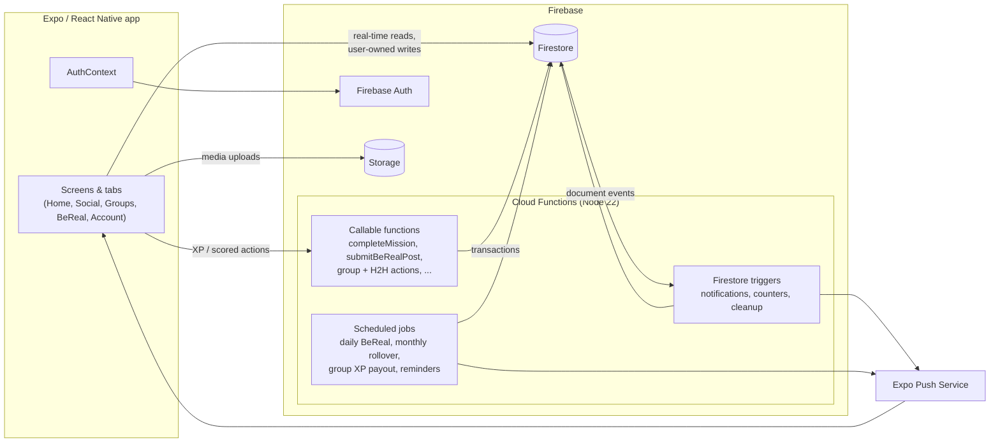
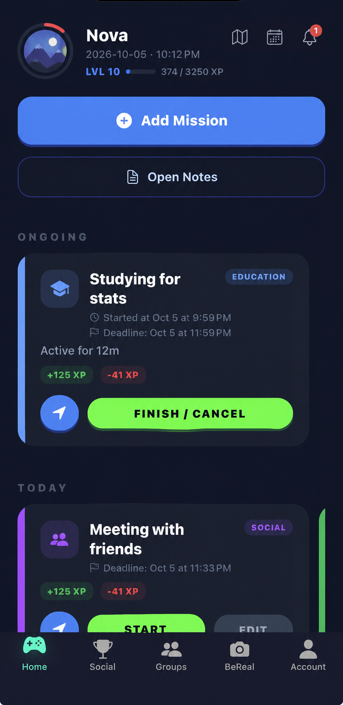
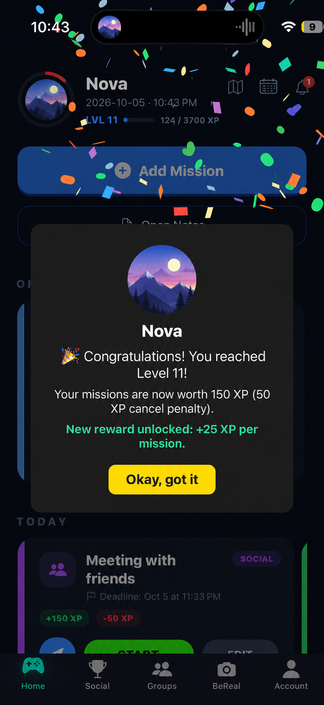
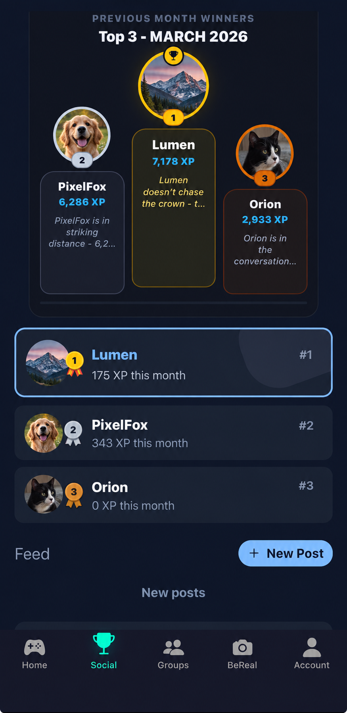
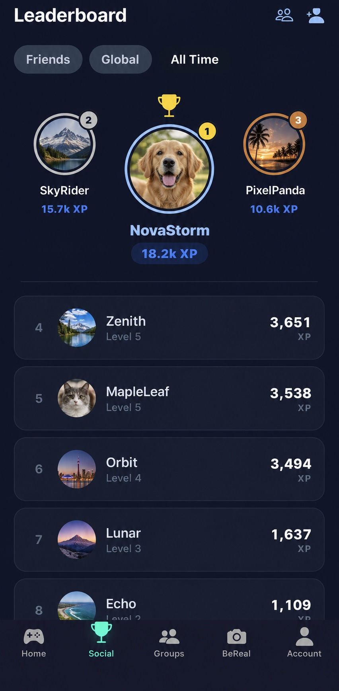
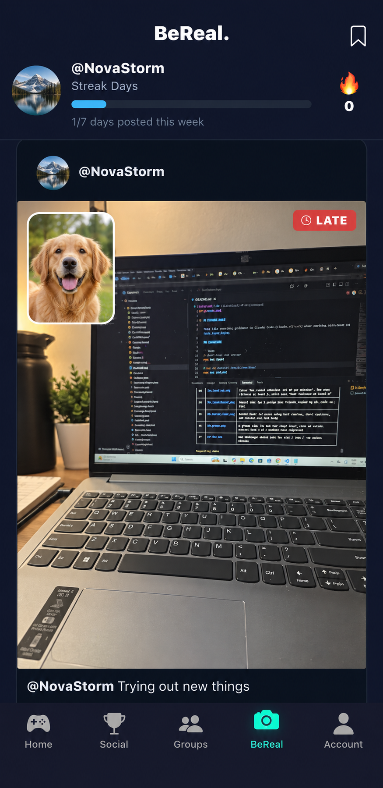
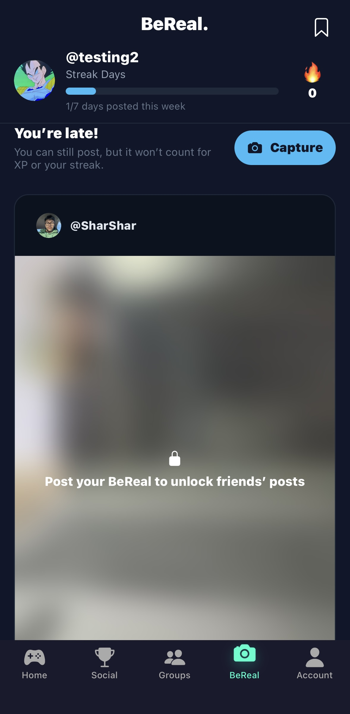
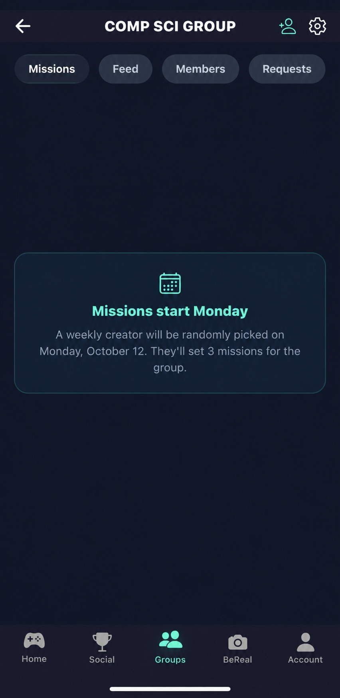

# DayPlanner

**A mobile app that turns your daily to-do list into missions: complete them to earn XP, level up, and compete with friends.**

> The source code for this project is private. This repo holds a written overview and screenshots. I'm happy to walk through the code in an interview (see [Contact](#contact)).

---

## What it does

Most to-do apps make it easy to write tasks down and easy to ignore them. DayPlanner adds stakes and a social layer:

- Every task is a **mission** with a deadline. Finish it and you earn XP. Miss the deadline and you lose some.
- XP feeds into a **level system** and **monthly leaderboards**, so friends can see who is actually getting things done.
- A daily **"BeReal"-style photo prompt** goes out at a random time, and **groups** and **1v1 challenges** let friends hold each other accountable.

It's an Expo / React Native app (iOS and Android) with a Firebase backend. All scoring logic runs server-side so users can't fake their progress.

---

## Key features

### Missions
- Create a mission with a title, category, and deadline. You can also schedule a start time, attach a map location, or save it to a personal library for later.
- The category is **suggested automatically** from keywords in the title, and there's a built-in library of starter missions across 8 categories (Health, Finance, Education, etc.).
- **Recurring missions**: pick dates on a calendar.
- **Destination missions**: attach a place (Google Places search) and open turn-by-turn directions.
- Calendar view of planned missions.
- **Offline completion**: if you finish a mission with no connection, it's queued and synced, with deduplication, when the device reconnects.

### XP, levels, and anti-cheat
- Each level needs more XP than the last. Missing a deadline costs a third of the mission's current XP value.
- Level-up and level-down modals with an XP progress ring. The level-up screen shows what your missions are now worth and when the next boost unlocks.
- Completions are validated **on the server**. A mission must have been created at least 10 minutes earlier and active for a minimum duration. XP is capped per hour, and repeated too-fast completions add "spam strikes" that temporarily suppress XP.

### XP boosts
Players earn more by staying consistent:

| Boost | How you earn it | Reward |
|---|---|---|
| **Level milestones** | Reaching level 6, then level 11 | Every mission is worth more: 100 XP at levels 1–5, **125** at 6–10, **150** from 11. Your planned and active missions update to show the new value. |
| **BeReal streaks** | Each full 7 days of on-time BeReal posts | **+100** XP for the first week, **+150** for the second, **+200** for every week after that. This is on top of the +25 per post. Missing a day resets the streak, and the next bonus starts at +100 again. |
| **Monthly awards** | Winning an award when the month rolls over | Winner of the Month (all-time leader) **+100**, Player of the Month (most XP gained) **+85**, Social Player of the Month (most posts and comments) **+60** |

All boosts are calculated and granted by Cloud Functions. Streak and award XP can't be claimed twice, even if a job retries.

### Social feed and friends
- Friend requests and friend search.
- Photo/video posts with comments and emoji reactions (one reaction per user per post).
- Leaderboards with **Friends / Global / All-Time** views, a **monthly top-3 podium**, and **monthly awards** (Player of the Month for most XP gained, Social Player of the Month for most posts and comments, and the all-time leader).

### Profiles and stats
- Tap anyone on the leaderboard, in a comment thread, in the BeReal feed, or in your friends list to open their profile.
- A profile shows the user's **level, total XP, and level progress**, plus missions completed, friend count, and BeReal streak.
- **Skill progress by category**: each of 7 categories (Health, Finance, Education, etc.) has a progress bar and a rank title that climbs as the user completes missions in that category. For example, Education goes from "Academic Liability" to "Academic Weapon".
- **Awards** the user has won: Winner, Player, and Social Player of the Month, with a count if they've won more than once.
- Send, accept, or decline a friend request directly from the profile.

### Friend map
- When you attach a location to a mission, you choose whether friends can see it. Sharing is **off by default**.
- The map on the Home screen shows a pin for each friend's **active** mission that they chose to share, with their profile picture, the mission title, and its category.
- Pins show the place attached to the mission, not anyone's live GPS position. Planned and completed missions never appear.
- A Cloud Function decides who sees what. It only returns missions from accepted friends that are active and shared, and it's rate-limited. Clients can't read other users' missions directly.

### Daily BeReal-style check-in
- Once a day, a push notification fires at a **random time between 12 PM and 10 PM**, and users have 30 minutes to post.
- Captures **both front and back camera** photos.
- On-time posts earn XP and build a daily streak, with bonus XP every 7 days. Late posts are still allowed but are tagged "LATE" and earn nothing. **Lateness is decided by the server**, not the client.
- The feed shows posts from your friends.
- **Post to see**: friends' BeReals stay blurred and locked until you've posted your own for the day.

### Groups and head-to-head challenges
- Groups of up to 15 members (max 3 groups per user) with invites, join requests, and ownership transfer.
- Group missions with photo proof. XP is paid out after the deadline, with a bonus for each member who *didn't* complete, so finishing when others slack off pays more.
- **1v1 challenges**: first to finish gets +125 XP, second gets +100, and not finishing costs −50.

### Notes
- A notes space, opened from the Home screen, for plans and ideas that don't fit in a mission.
- **Link a note to a mission**, either from the note editor or straight from a mission's detail screen. The note shows the mission's title, category, status, and date, and keeps them updated as the mission changes. If the mission is deleted, the note says so instead of breaking.
- **Pin** important notes and **archive** old ones into named folders.
- **Search** across note text and linked-mission keywords, and sort by newest, oldest, or A–Z.
- Notes are private to their owner. Input is cleaned on the client, and the security rules enforce allowed fields and length limits (120-character titles, 4,000-character bodies).

### Notifications
- Push notifications for missions due soon, inactivity reminders, friend requests, comments, likes, group activity, challenge results, and monthly awards.

---

## Tech stack

| Layer | Technology |
|---|---|
| Mobile app | React Native 0.81, Expo SDK 54, React 19, React Navigation (stack + bottom tabs) |
| Auth | Firebase Authentication (email/password, with email verification required) |
| Database | Cloud Firestore |
| File storage | Firebase Storage (profile pictures, feed media, BeReal photos) |
| Backend logic | Firebase Cloud Functions v2 (Node 22): callable functions, Firestore triggers, scheduled jobs |
| Push notifications | Expo Push Notification service |
| Maps / places | `react-native-maps`, Google Places Autocomplete |
| Builds & updates | EAS Build, EAS Update (over-the-air updates) |
| CI | GitHub Actions running Gitleaks (secret scanning) and Semgrep (static analysis) on PRs and `main` |

---

## Architecture

The client handles UI and reads data from Firestore in real time. Any action that changes **XP, levels, streaks, leaderboards, or trust flags** goes through a Cloud Function. Firestore security rules block clients from writing those fields directly.

The backend has about 50 Cloud Functions: 20 callable endpoints, 11 scheduled jobs, and the rest Firestore triggers.

---

## Technical decisions and tradeoffs

**Server-authoritative scoring.** Early versions awarded XP from the client. I moved all XP, streak, and leaderboard writes into Cloud Functions that run inside Firestore transactions, and locked those fields in the security rules. *Tradeoff:* each completion takes a network round trip and costs a function call, and the app needed a separate offline path (below).

**Offline completions as a queue, not a shortcut.** When offline, the client writes a pending-completion record. On reconnect, a sync function checks ownership, deduplicates against past completions, and awards XP. The client never grants XP to itself, even offline.

**Idempotent scheduled jobs.** Scheduled functions can run more than once, so each job checks before acting:
- The daily BeReal window is created once per day and "claimed" in a transaction, so overlapping runs can't send a second notification.
- The monthly leaderboard rollover writes rankings in pages and only writes its "done" marker after every page succeeds, so a crash mid-run is safe to retry.
- Monthly award XP uses a per-user idempotency token, so retries never double-credit anyone.

**Anti-abuse rules over trust.** Completion cooldowns, minimum active time, hourly XP caps, escalating spam strikes, and per-user per-function rate limits (stored in Firestore) make farming XP slow and unrewarding. *Tradeoff:* these rules sometimes block legitimate fast completions. The server returns a reason code so the UI can explain why no XP was given.

**Single time zone for daily and monthly boundaries.** Day keys, monthly rollovers, and the BeReal window all use one fixed time zone. This keeps "what day is it?" consistent across users. The downside is that it favors users in that zone.

**Denormalized audience lists.** Each BeReal post stores the list of friends it was shared with when it was written, so building the feed is a single query instead of a join across friendships. *Tradeoff:* a friendship created after a post doesn't add that post to the new friend's feed.

**Polling scheduler for random-time events.** The daily BeReal time is random, so a planner job picks the time each day and a per-minute job checks whether it has arrived. It's simple and reliable, at the cost of a function run every minute.

---

## How it was built

This was built by a two-person team built with an **AI-assisted workflow**. In practice:

- I used AI coding agents (Claude Code and OpenAI Codex) to draft features, refactors, and Cloud Functions. I set the requirements, reviewed the output, tested on device, and decided what shipped.
- The repo has project-level instruction files for the agents: a coding-conventions guide, a security policy with a threat model, and reusable checklists for pre-push verification, security review, and new UI components. Larger features, like Groups, started from a written spec that the agent worked from.
- Pull requests went through an AI reviewer (CodeRabbit), and many commits address its suggestions. My rule was that AI review doesn't replace human review for authorization, secrets, input validation, and security rules.
- CI runs Gitleaks and Semgrep on every pull request and every push to `main`.

The most valuable part of this workflow wasn't generating code faster. It was having to write requirements and security rules precisely enough for an agent to follow, and then checking that the output actually met them.

---

## Challenges and what I learned

- **Clients can't be trusted with scores.** My first version wrote XP directly from the app, so anyone could edit their own score. Moving scoring server-side meant redesigning data ownership, writing security rules that block specific fields, and building an offline queue. I learned to decide up front whether logic belongs on the client or the server.
- **Scheduled jobs run more than once.** Duplicate notifications and partially finished monthly rollovers taught me to make every job safe to re-run by checking state and claiming work in transactions.
- **Designing anti-cheat that doesn't punish real users.** Cooldowns and XP caps needed tuning, plus clear feedback so users understood why a completion gave no XP.
- **Reviewing AI-written code.** Agents produce plausible code quickly, including code that is subtly wrong about authorization or edge cases. Review checklists and a written security policy made that review consistent.
- **Shipping a real mobile app.** EAS builds, over-the-air updates, push-notification tokens, platform permissions, and app-store build numbers were all new to me.

---

## Screenshots

### Missions and progress

| | |
|---|---|
|    *Home: today's missions, level, and XP progress* |    *Leveling up: missions are now worth more XP* |

**Creating a mission:** auto-suggested category, deadline, and location

https://github.com/user-attachments/assets/eb833946-fe72-41b1-a6e6-0bf0ad267b02

**Browsing a profile:** level, XP, skill progress by category, and awards

https://github.com/user-attachments/assets/21952bcd-54b6-4102-b46b-1f87f4e5cdd5

### Leaderboards

| | |
|---|---|
|    *Monthly top-3 podium* |    *All-time rankings* |

### Daily BeReal

| | |
|---|---|
|    *A dual-camera BeReal post, marked LATE (no XP or streak credit)* |    *Friends' posts stay blurred until you post your own* |

### Groups and 1v1 challenges

*Groups: each week a randomly picked member sets 3 missions for the group*

**1v1 challenge walkthrough**

https://github.com/user-attachments/assets/5bd0661a-a3be-4ba2-885f-ef41c7939e05

### Notes

**Notes:** pinned notes, folders, search, and links to missions

https://github.com/user-attachments/assets/8c4c7d2e-0004-44b8-bc9a-d54ab2a45c63

---

## Status

Built in React Native with Firebase, actively developed since September 2025. Not publicly released.

## Contact

- **Name:** Saajid Shaharyar
- **LinkedIn:** [linkedin.com/in/saajid-shaharyar](https://www.linkedin.com/in/saajid-shaharyar-3a5909224/)

Source is private. I can walk through the code on request. A full demo video is available on request."
